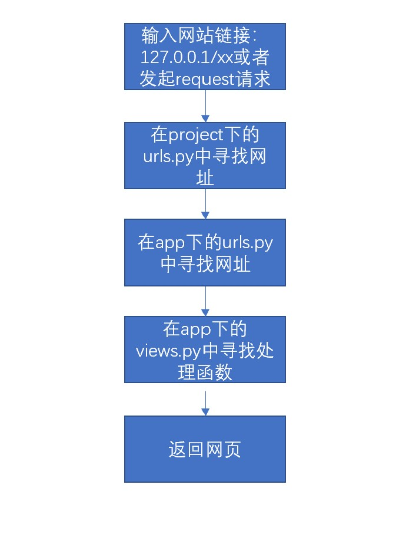
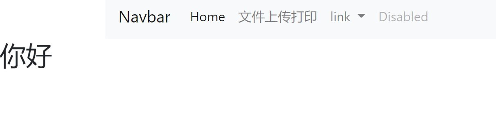

# Django快速入门
> 本文记录了在短期时间内搭建django框架，并实现能够动态调用python算法包，实现在网页上动态绘图，并显示计算结果的表格
> 本文参考学习资源：
> 1. [B站学习视频](https://www.bilibili.com/video/BV1QK4y1x7Bj) 
> 2. [Django官方文档](https://www.djangoproject.com/)
> 3. [bootstrp4.6官方文档](https://getbootstrap.com/docs/4.6/getting-started/introduction/)
# 安装django
> 默认安装的是anaconda环境，一下安装语句在命令行窗口进行
1. 使用anaconda 创建新环境
```commandline
conda create -n 环境名 python=3.8
```
2. 激活环境
```commandline
conda activate 环境名
（以下的代码都在虚拟环境下进行）
```
3. 切换清华源
```commandline
pip config set global.index-url https://pypi.tuna.tsinghua.edu.cn/simple
```
4. 安装django
```commandline
pip install django
```
# django项目创建
1. 创建项目  
应该事先将命令窗口cd到你要保存项目的地址下
```commandline
django-admin startproject 项目名
```
2. 创建app  
django一个项目可以包含多个APP，一个app也可以被多个项目拥有，可以简单理解为网站的一个功能模块，比如你可以将个人主页创建为一个app,论坛功能设置为
   另一个app
```commandline
（需要先进入项目目录）
cd 项目名
python manage.py startapp app名
```
3. 其他设置
```commandline
1. 迁移默认数据库
python manage.py migrate
2. 打开服务器
python manage.py runserver
```
4. 结果  
如果你按照上面的步骤操作，将得到下面的结果  
   <div align="center">
   
   </div>
   <div align="center">
   
   </div>
# django项目结构
<div align="center">
   
   </div>
如上图所示，在myproject中存储的是与项目有关的设置文件，在myapp中存储的则是功能模块的文件  
  
当输入一个网址或者点击一个模块发起request请求后，django服务器的处理流程如下：  
<div align="center">
   
   </div>
# django项目设置  

1. 更改`setting.py`文件
```python
# 加入新建的app
INSTALLED_APPS = [
    'django.contrib.admin',
    'django.contrib.auth',
    'django.contrib.contenttypes',
    'django.contrib.sessions',
    'django.contrib.messages',
    'django.contrib.staticfiles',
    'myapp'
]
# 更改时区语言
LANGUAGE_CODE = 'zh-hans'

TIME_ZONE = 'Asia/Shanghai'
```
2. 添加urls和templates及static文件夹  
在app下新建`urls.py `以及`templates`和`static`文件夹  
   <div align="center">
   
   </div>

3.更改urls文件
将project下的urls.py更改为：
```python
from django.contrib import admin
from django.urls import path,include

urlpatterns = [
    path('admin/', admin.site.urls),
    path('',include('myapp.urls'))
]
```
> 当访问一个网址`127.0.0.1/xx`时，django首先会在project下的`urls.py`寻找这个网址后面的名字`xx`,按照顺序依次寻找符合的网页并返回  
> 比如让你输入`127.0.0.1/admin`时，django就会定位到 `admin.site.urls`，去这个文件中寻找相应的网址并返回  
> 当找不到时，django就会继续去 `myapp.urls`寻找

将app下的urls.py更改为：
```python
from django.urls import path
from . import views
urlpatterns = [
    #path('',views.homepage,name = 'homepage')
]
```
> 这里解释一下，  
> path中第一个参数，就是我们访问网址后127.0.0.1/xx中“xx”的内容，换言之，代码中的空字符串就代表主页，127.0.0.1网址后面什么也不加的情况  
> path中第二个参数，代表当遇到网址后，如何处理和返回新网页，就是views中的函数，我们暂时还没后创建这个函数  
> path中第三个参数，代表这个网址的名字，可以在网页中直接使用，留在下文介绍  

# 创建第一个网页 
## 创建模板网页  
在`myapp/templates`下创建`index.html`文件如下
```html
<!doctype html>
<html lang="en">
<head>
    <meta charset="UTF-8">


   <link rel="stylesheet" href="https://cdn.jsdelivr.net/npm/bootstrap@4.6.0/dist/css/bootstrap.min.css" integrity="sha384-B0vP5xmATw1+K9KRQjQERJvTumQW0nPEzvF6L/Z6nronJ3oUOFUFpCjEUQouq2+l" crossorigin="anonymous">
    <title></title>
</head>
<body>
    <div class = 'container'>
        
    </div>
    

    
<script src="https://code.jquery.com/jquery-3.5.1.slim.min.js" integrity="sha384-DfXdz2htPH0lsSSs5nCTpuj/zy4C+OGpamoFVy38MVBnE+IbbVYUew+OrCXaRkfj" crossorigin="anonymous"></script>
<script src="https://cdn.jsdelivr.net/npm/popper.js@1.16.1/dist/umd/popper.min.js" integrity="sha384-9/reFTGAW83EW2RDu2S0VKaIzap3H66lZH81PoYlFhbGU+6BZp6G7niu735Sk7lN" crossorigin="anonymous"></script>
<script src="https://cdn.jsdelivr.net/npm/bootstrap@4.6.0/dist/js/bootstrap.min.js" integrity="sha384-+YQ4JLhjyBLPDQt//I+STsc9iw4uQqACwlvpslubQzn4u2UU2UFM80nGisd026JF" crossorigin="anonymous"></script>
</body>
</html>
```
> 1. `<link>`和`<script>`是对`bootstrap4.6`插件的引用
> 2. ``是django的模板引用方式，可以在其他文档之通过定义，来替换block的内容
> 3. `` 引用其他html中的组件，在本实例中，仅包含一个navbar，下载地址见github
> 4. ` `是代表内容区块，后面可以直接定义替换
## 创建主页  
在`myapp/templates`下创建`home.html`文件如下
```html

首页

    <div>
    <h2>你好</h2>
    </div>

```
> 这里的``继承并替换index模板中的内容

## 定义主页视图
在`myapp/views.py`中加入：
```python
def homepage(request):
    context = {
        
    }
    return render(request,'home.html',context)
```
> request是点击或输入网址后传入的`httprequest`  
> `homes.html`是传回的文件  
> `context`是传回的参数，可以在homes中显示  
> **简单说，就是网页传回一个request,里面包含输入的参数,经过后台处理，将计算结果`context`通过`home.html`返回**

## 注册主页
在`myapp/urls.py`中加入:
```python
urlpatterns = [
    path('',views.homepage,name = 'homepage')
]
```
> 当访问时，通过这里找到合适的views处理函数
## 输出结果
在浏览器输入：`http://127.0.0.1:8000/`
   <div align="center">
   
   </div>  

# 文件传输与表格打印功能实现
## 写前端HTML
1. 文件上传页`filetransfer.html`
```html
    <form action="" method="post" enctype="multipart/form-data">
        
        <p><input type="file" name="up_file"></p>
        <input type="submit">
    </form>
```
> 这里的``是点击提交后的处理事项，这里的`fileprint`是执行打印表的另一个网页，在下面定义,即点击后返回打印文件页
2. 文件打印页`file_print.html`
```html
 <table class="table table-hover">
                  <thead class="thead-dark">
                    <tr>
                        
                            <th scope="col">{{ column }}</th>
                        
                    </tr>
                  </thead>
                  <tbody>
                    
                            <tr>
                                
                                    <td>{{ v }}</td>
                                
                        </tr>
                    
                  </tbody>
            </table>
```
>这里的`data_head,datavalues`都在fileprint视图中定义并返回 
## 创建视图
在`myapp/views.py`中加入：
```python
from django.conf import  settings
import os
import pandas as pd


def filetransfer(request):
    return render(request, "filetransfer.html", locals())

def file_print(request):
    if request.method == "POST":
        #获取上传的文件
        file_obj = request.FILES.get("up_file")
        #获取当前项目的路径
        base = str(settings.BASE_DIR)
        # 文件本地存储地址
        path = os.path.join(base ,'myapp/static/file_upload',file_obj.name)
        # 将文件写入本地静态文件夹
        with open(path,'wb') as f1:
            for i in file_obj.chunks():
                f1.write(i)
        # 读取上传的文件(内存中)
        df = pd.read_excel(file_obj)
        # 获取列名和值
        df1_head = df.columns.values.tolist()
        df1_values = df.values.tolist()
        # 返回列名和值的列表
        context = {
            'data_head': df1_head,
            'data_values': df1_values,
        }
    return render(request,'file_print.html',context)
```
## 注册网页
在`myapp/urls.py`中加入：
```python
path('filetransfer',views.filetransfer,name = 'filetransfer'),
path('fileprint',views.file_print,name = 'fileprint'),
```
## 更改navbar中的连接
在navbar中任意一个nav-item中更改连接如下
```html
 <li class="nav-item">
        <a class="nav-link" href="">文件上传打印</a>
      </li>
```
## 实现结果  
1. 首页：
<div align="center">
   
   </div>
2. 文件上传页，选择example中的excel文件  
<div align="center">
   
   </div>
3. 点击提交后的文件打印页:
<div align="center">
   
   </div>
4. 上传的文件已经存储到了定义的文件夹中  
<div align="center">
   
   </div>

# 实现matplotlib绘图功能
## 前端`draw.html`:  

```html
 
图片

    <div class="container">
        
    </div>

```
## 定义绘图函数
创建文件`myapp/func/drawpic.py`
```python
import matplotlib.pyplot as plt
import numpy as np
import base64
from io import BytesIO

def draw_pic():
    x = np.linspace(0, 15, 10)
    y = x * 2
    plt.plot(x, y)
    buffer = BytesIO()
    plt.savefig(buffer)
    plot_data = buffer.getvalue()
    imb = base64.b64encode(plot_data)  # 对plot_data进行编码
    ims = imb.decode()
    imd = "data:image/png;base64," + ims
    return imd
```
## 视图函数  
```python
from .func.drawpic import draw_pic

def draw(request):
    imd = draw_pic()
    context = {
        'img': imd,
    }
    return render(request,'draw.html',context)
```
## 注册网页
在`myapp/urls.py`中加入：
```python
path('draw',views.draw,name = 'draw')
```
## 打印效果
输入`127.0.0.1:8000/draw`
<div align="center">
   
   </div>
