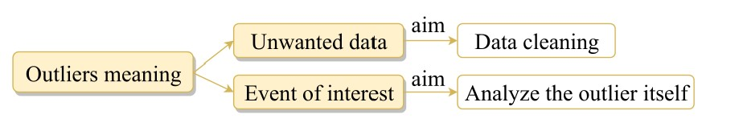
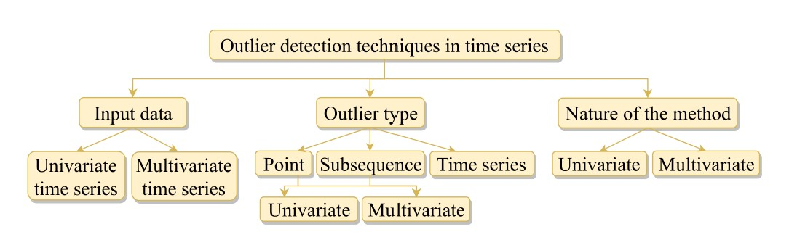
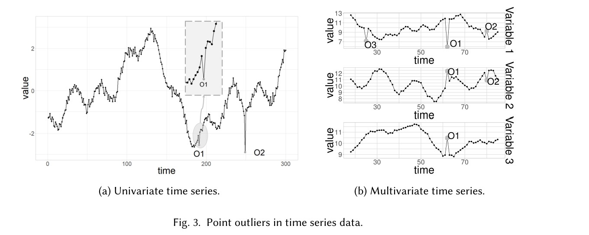
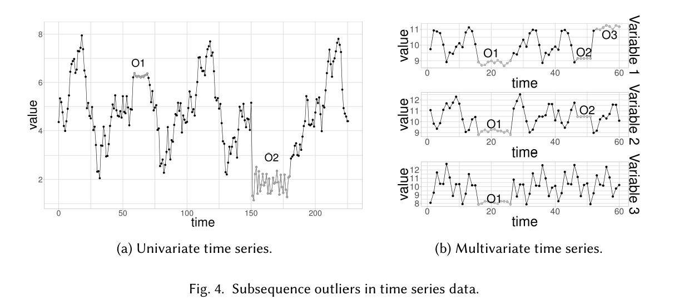
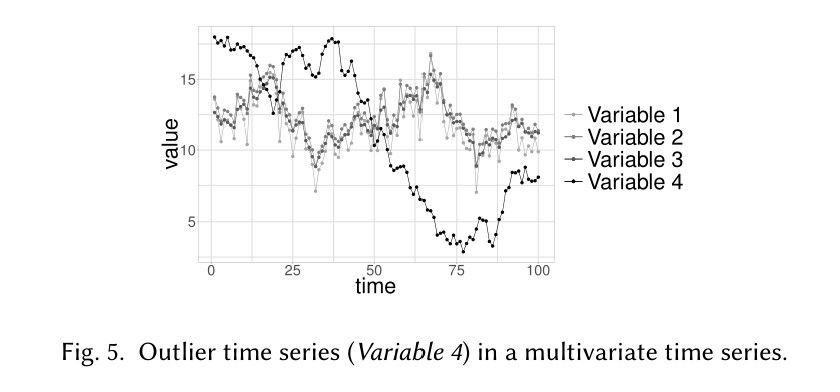
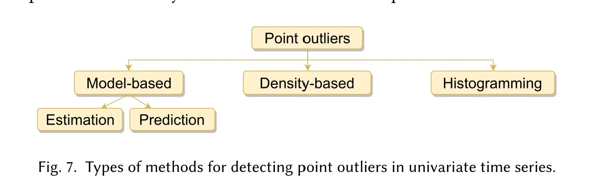
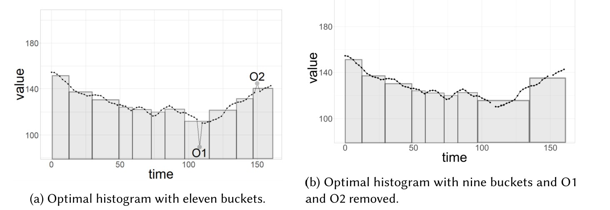
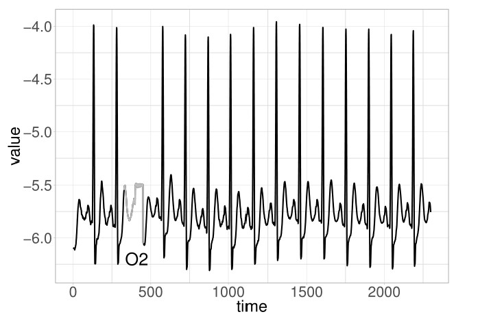
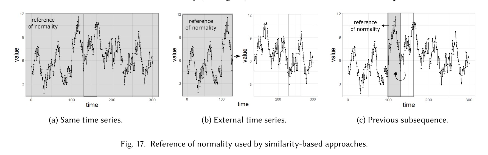

---

---

  @[TOC](时间序列异常值检测综述)

# 介绍

1. 异常值的定义：
   > “An observation which deviates so much from other observations as to arouse suspicions that it was generated by a different mechanism.  
   > 一个与其他观察值偏离非常大，以至于让人怀疑它是用另一种不同的机制中产生的数据。
2. 异常值的两种不同用途
   
   
   - 正常数据中的异常点，可以理解为数据噪声，是模型训练中希望剔除的数据，它的存在会减低数据的质量，影响模型的训练效果
   - 数据中的异常值，是在训练中希望能够检测和分析的数据，它反映出了系统中某些不正常现象或者变化的发生，是希望能够找到并用来作为训练数据的样本。

# 时间序列异常值检测的分类

1. 输入数据的类型
   - 一维数据
   - 多维数据
2. 异常值的类型
   - 异常点  
      异常值是样本中一个点
     
   - 异常子序列
     异常值是多个连续样本组成的一个序列
     
   - 异常时间序列  
      异常值是由某个变量的时间序列整体组成，只能用于多维输入的情况
     
3. 检测方法的原理

   - 以单变量数据作为输入  
      也可以用域多变量数据的处理，不考虑多变量之间的相关关系
   - 以多变量数据作为输入

4. 注意  
   由于异常值的定义一般取决于选择的方法，或者数据本身的特点，因此当选择整个时间序列作为分析对象时，得到的异常点是全局的(`global`)，而仅选择一个邻域或者一段子序列进行分析的时候，得到的异常点是局部的(`local`)  
   一个在全局看正常的样本，在局部邻域内可能是异常的点

# 点异常样本的检测

两大主要特点：

1. 是否将时间作为变量

   - 完全考虑样本的时间顺序
   - 将样本划分为不同的时间窗，在一个时间窗内，不区分时间顺序
   - 不考虑样本的时间顺序

2. 是否能实现实时预测
   - 一些异常值检测算法，需要同时考虑一个点过去和将来的数据，不能实现来一个新样本，判断一个
   - 另一些检测算法，则只考虑新样本点和之前的历史数据，可以实现实时判断样本点是否是异常点

## 单变量时间序列

主要分类：

### 基于模型的方法

通过判断样本值与期望值之间的差距是否超过临界值，来判断样本点是否是异常样本

$$
\left|x_{t}-\hat{x}_{t}\right|>\tau
$$

按照求期望值的不同，又可分为：
$$
\begin{array}{lccccccc}
\hline & \text { Data used } & \longrightarrow & \text { Expected value } & \longrightarrow & \text { Point outliers } \\
\hline \text { Estimation models } & \left\{x_{t-k_{1}}, \ldots, x_{t}, \ldots, x_{t+k_{2}}\right\} & \longrightarrow & \hat{x}_{t} & \longrightarrow & \left|x_{t}-\hat{x}_{t}\right|>\tau \\
\text { Prediction models } & \left\{x_{t-k}, \ldots, x_{t-1}\right\} & \longrightarrow & \hat{x}_{t} & & \\
\hline
\end{array}
$$

#### 基于预测模型

​	基于预测模型的方法，仅使用过去的数据来预测新样本的预测值

常见的预测模型

1.  固定模型

   DeepAnT 

2.  变化模型

   ARIMA

3. 极值理论

   SPOT（Peaks-Over_threshold）固定分布

   DSPOT 漂移分布

#### 基于估计模型

​	依据估计模型的方法，同时使用过去和将来的数据，预测某样本的预测值

常见的估计模型：

1. 基于常数或分段统计特征

   MAD（Median Absolute Deviation ）

2. 基于拟合模型和变量分布函数

   Extreme Studentized Deviate (ESD)

3. 基于残差

   ARIMA （**A**uto**r**egressive **I**ntegrated **M**oving **A**verage mode）

### 基于密度的方法

$$
x_{t} \text { is an outlier } \Longleftrightarrow\left|\left\{x \in X \mid d\left(x, x_{t}\right) \leq R\right\}\right|<\tau
$$

$$
\tau_{p}+\tau_{s}<\tau
$$

$\tau_{p}$ 和 $\tau_{s}$ 分别是一个点之前和之后，距离小于R的点的数量

### 基于直方图的方法

通过定义一个异常评价函数（越低越好），当除去一个点后，若评价值降低，则将此点视为异常值

## 多变量时间序列

### 单变量方法

事实上，当不考虑多变量之间的相关性时，所有上面提到的单变量方法，都可以用于多变量时间序列异常检测，当然实际使用中，这样的做法很少见

1. 对每个维度分别进行异常值检测

   Long Short-Term Memory (LSTM)

2. 数据降维

   将相关的多维变量，降维成不相关的多维变量

   常见的降维方法：

   - 增量主成分分析
   - 最优投影法
   - Independent Component Analysis (ICA) 

3. 数据转换

   将多变量数据转换成一维的时间序列数据

### 多变量方法

1. 基于估计模型
   $$
   \left\|x_{t}-\hat{x}_{t}\right\|>\tau
   $$

   - autoencoders

2. 基于预测模型

   - Contextual Hidden Markov Model (CHMM) 
   - DeepAnt

3. 基于相异度

   不训练模型，而直接比较样本之间相似度

4. 基于直方图

   方法类似上面的单变量方法中的介绍

# 序列异常段的检测

这里的定义的异常不再是某一时刻的单一样本点，而是一段时间内连续的样本点构成的序列，它们的某些特征与正常变化不同

通常的分类有以下几种

1. **考虑子序列的长度**

   按照不同方法在长度选择上的不同，又可分为：

   - 固定长度检测（需要手动设置检测片段的长度）
   - 可变长度检测

2. **考虑系列的表达方式**

   由于考虑原始的时间序列数据，通常会导致问题过于复杂，因此通常会使用离散化（Discretization）处理的方法，对原始数据进行处理

   - equal-frequency binning
   - equal-width binning

3. **考虑周期性**

   有的场景下，时间序列数据会随着周期性不断地重复，因此在进行异常检测时，除了时间之外，还需要额外考虑周期性的影响

按照对流数据处理方式不同又可分为以下几类：

1. 来一个新点，就判断包含此点的序列是否是异常序列
2. 来一段序列，判断此序列是否异常
3. 来一批数据，判断数据中是否存在异常序列

## 单变量时间序列

1. **不协调检测**

   将一段序列与其他的序列段进行比较，找到与其他序列差异最大的序列段

   

   - 使用HOT-SAX方法的各种变体，来降低比较过程中的时间复杂度

   特点：往往需要用户来指定检测的时间长度，并且输出结果不能判断这个点是异常点，而通常需要人工来判断，因为它只是检测出最不寻常的点，不代表这个点就是异常点，通常也不没有一个特定的判断临界值等

2. **相异度检测**
   $$
   s(S, \hat{S})>\tau
   $$

s()函数是衡量两段子序列之间相异度的函数，当相异度超过一个临界值，被标记为异常点

按照衡量相异度时，选择作为正常值的参考不同，又可分为以下几种方法：

- 以相同时间序列内容作为参考

  - 聚类方法

    （通常需要对原始的连续数据进行离散化处理）通过将不同的子序列进行聚类，将聚类中心作为期望值，从而将远离中心，或者所在类成员比较少的，判断为异常序列

    - Fuzzy C-Means (FCM)
    - 动态聚类

  - 相异度衡量

- 使用外部序列作为参考

- 使用历史序列作为参考

3. **基于预测模型**

$$
\sum_{i=p}^{p+n-1}\left|x_{i}-\hat{x}_{i}\right|>\tau
$$

$$
\sum_{i=p}^{p+n-1}\left|x_{i}-\hat{x}_{i}\right|>\tau
$$

- 预测每个序列点（上面的单点预测方法都可以用）
- 预测整段时间序列（通常使用CNN）

4. 基于频率
   $$
   |f(S)-\hat{f}(S)|>\tau
   $$

通过预计频率与真实频率的差异，来判断是否是异常序列

4. **基于信息理论**
   $$
   I(S) \times f(S)>\tau
   $$

I(s)是序列携带的信息，序列越罕见，信息值越大

f(s)是序列出现的此时

## 多变量时间序列

